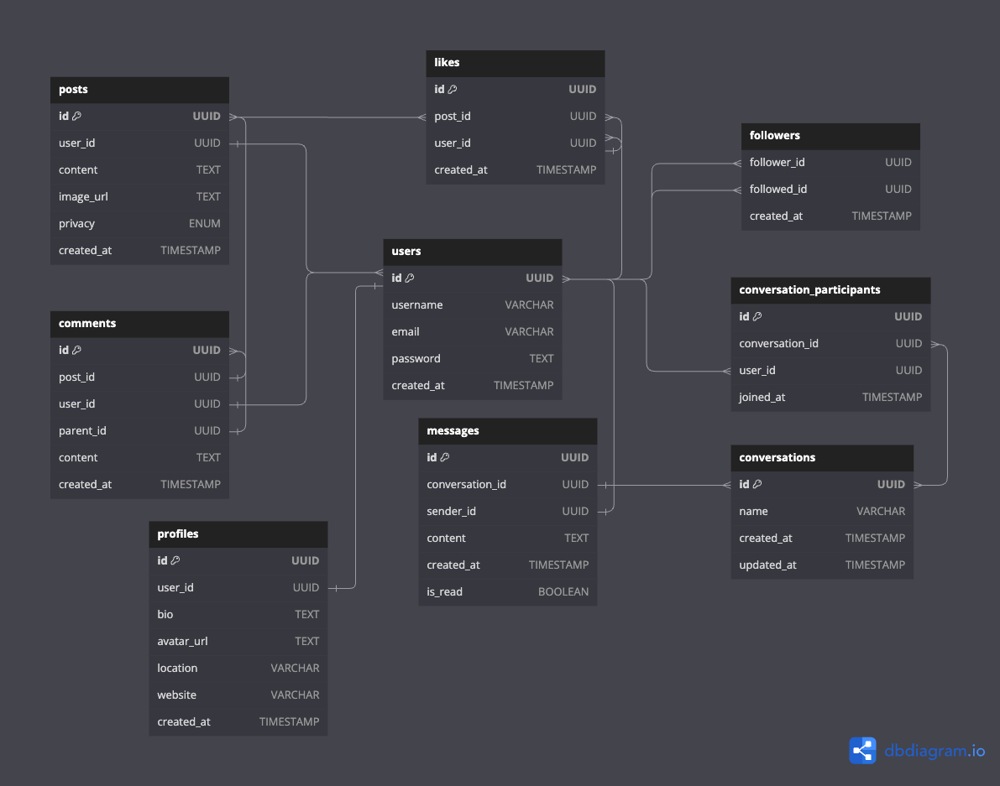

# Isntagram API

This is the backend API for my social media app. The API supports user authentication, posts, comments, and chats. Built with Node.js and Express.js, using PostgreSQL as the database and Prisma ORM for database management. Featuring custom JWT-based authentication and GitHub OAuth integration.

## ER Diagram

## Features

- Custom JWT-based authentication
- GitHub OAuth integration
- CRUD operations for posts, comments, and chats

## Endpoints

### Posts

| Endpoint        | HTTP Request | Description                                        | Requires Authentication? |
| --------------- | ------------ | -------------------------------------------------- | :----------------------: |
| /posts          | POST         | Create a post with an image upload                 |            ✅            |
| /posts          | GET          | Get all posts from the authenticated user          |            ✅            |
| /posts/:id      | GET          | Get a single post by post ID if authorized         |            ✅            |
| /posts/:id      | PATCH        | Update a specific post by ID                       |            ✅            |
| /posts/:id      | DELETE       | Deletes a specific post by ID                      |            ✅            |
| /posts/:id/like | POST         | Authenticated user likes the specific post by ID   |            ✅            |
| /posts/:id/like | DELETE       | Authenticated user unlikes the specific post by ID |            ✅            |

### Users

## Development

## Future Steps
